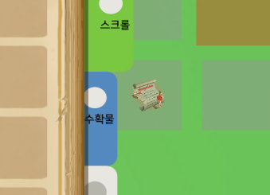

# GitHub 이슈에 이미지 업로드와 저장 방식 정리

블로그에 사진을 올리기 위해 방법을 찾아보던 중 깃허브 이슈를 이용한 방법을 알게 되었다.

그러고 보니 깃허브 이슈에 이미지를 올리면 파일이 첨부되는게 아니라 URL하나가 생성되었었다. 
이상함을 느끼지 못했었는데 생각해보니 이 주소는 뭐고 이미지는 어디에 저장되는 것인가. (주소를 보면 아마존 서버인 것은 알 수 있다)

---

## 1. GitHub 이슈에 이미지 업로드하면 어디에 저장되나?

- GitHub에서 이슈/PR/위키 등에 이미지를 드래그 또는 붙여넣기로 업로드하면,
- 실제 저장 위치는 GitHub 서버가 사용하는 **Amazon S3 (AWS S3)** 입니다.

### 업로드 예시

```
https://user-images.githubusercontent.com/12345678/파일명.png
```

- 이 경로는 Amazon S3에 저장된 정적 파일 링크입니다.

---

## 2. 이 링크는 얼마나 오래 유지되나?

- GitHub는 **공식적으로 "영구 보존"을 보장하지는 않습니다.**
- 그러나 일반적으로 **이미지 링크는 사실상 반영구적으로 유지**됩니다.

### 삭제될 수 있는 경우

- 이미지가 GitHub 내부에서 **전혀 참조되지 않는 경우**
- GitHub 계정이 삭제된 경우
- 정책 위반, 스팸 등으로 인한 제재
- GitHub가 내부 정책상 자산 정리를 수행하는 경우

> 현실적으로 GitHub에 등록된 이미지들은 수년 동안 유지됨

---

## 3. GitHub는 어떻게 참조 여부를 알까?

- 사실 GitHub는 **참조 여부를 명시적으로 추적하지 않습니다.**
- 업로드 즉시 퍼블릭 URL을 발급하고, 해당 이미지를 **사용하든 말든 삭제하지 않고 유지**합니다.
- 내부적으로 사용 분석이나 정리 정책이 있을 가능성은 있지만, **공개적으로는 삭제하지 않는 방식**입니다.

---

## 4. AWS S3란?

- AWS S3는 Amazon에서 제공하는 클라우드 스토리지 서비스로,
- GitHub는 이 저장소를 통해 이미지 등 정적 파일을 관리합니다.

### 특징

| 항목 | 설명 |
|------|------|
| 구조 | 객체 기반 저장소 (버킷 + 키 구조) |
| 저장 용량 | 무제한 확장 가능 |
| 신뢰성 | 99.999999999% 내구성 |
| 사용 요금 | 사용자 계정에서는 사용량만큼 요금 부과됨 (GitHub 사용자와는 무관) |

---

## 5. GitHub 이미지 업로드 = 요금 발생?

GitHub를 통해 이미지 올릴 경우 사용자에게는 요금이 발생하지 않습니다.

| 항목 | 사용자 요금 발생 여부 |
|------|----------------------|
| GitHub 이슈 이미지 업로드 | 없음 |
| AWS S3에 직접 업로드 (내 계정) | 있음 |
| GitHub Pages에 이미지 사용 | 없음 |
| GitHub Actions에서 AWS와 연동해 업로드 | AWS 요금 부과될 수 있음 |

---

## 6. 요약

| 질문 | 답변 |
|------|------|
| 이미지 저장 위치는? | AWS S3 (user-images.githubusercontent.com) |
| 얼마동안 유지됨? | 참조되고 있다면 사실상 무제한 유지 |
| 참조 추적하나? | 명시적 추적 없음, 삭제도 거의 없음 |
| 요금 발생하나? | GitHub 사용자에게는 요금 없음 |
| 삭제될 수 있나? | 거의 없지만, GitHub 정책상 가능성 존재 |

---

## 7. 정리

- README, 블로그, 위키, 댓글 등에 안심하고 사용 가능
- 정적 리소스가 많을 경우 GitHub Issue를 이미지 호스팅처럼 사용할 수 있음
- 단, 민감한 이미지나 대용량 파일은 Git LFS 또는 외부 CDN이 더 적합함


## TEST




