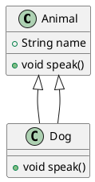
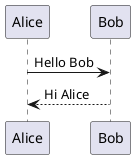
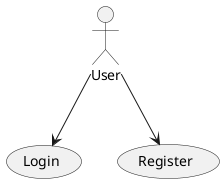
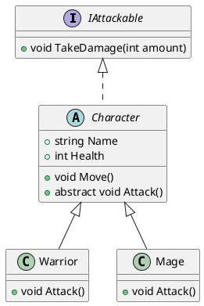
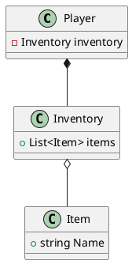
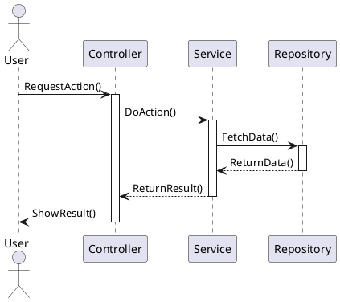
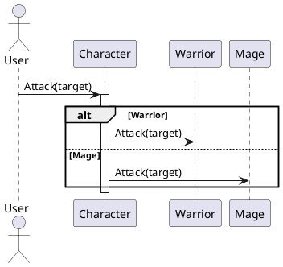
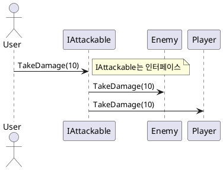

# 1. PlantUML 개요와 다이어그램 작성 정보

### 1. PlantUML이란?

* UML 다이어그램을 **코드 기반으로 작성**하는 도구
* 텍스트 스크립트를 이용해 **이미지 형태의 다이어그램 생성**
* Java 기반 도구로 **웹, 로컬, IDE 플러그인** 지원

```plantuml
@startuml
... 다이어그램 내용 ...
@enduml
```

---

### 2. 클래스 다이어그램 예시



→ `Animal` 클래스와 `Dog` 클래스, `Dog`가 `Animal` 상속

---

### 3. 화살표/관계 기호 의미

| 기호        | 의미     | 설명             |          
| --------- | ------ | ------------------ | 
| `A --> B` | 연관 관계  | A가 B를 참조           |                 
| `A --\|> B` | 실체화 관계     | A가 B 인터페이스 구현      
| `A <\| -- B` | 일반화(상속)    | B가 A를 상속           
| `A *-- B` | 합성 관계  | A가 B 포함 (생명 주기 공유) |                  
| `A o-- B` | 집합 관계  | A가 B 포함 (생명 주기 독립) |                   
| `A ..> B` | 의존 관계  | A가 B에 의존           |                   
| `A ..\| > B`  | 의존 + 실체화   | A가 B 인터페이스 의존 및 구현 

---

### 4. 접근자 표시

| 기호  | 의미        |
| --- | --------- |
| `+` | public    |
| `-` | private   |
| `#` | protected |
| `~` | package   |

예시:

```plantuml
class Person {
    -String name
    +void Speak()
}
```

---

### 5. 시퀀스 다이어그램 예시



→ `Alice`가 `Bob`에게 메시지를 보내고 응답 받음

---

### 6. 유스케이스 다이어그램 예시



→ `User`가 `Login`, `Register` 유스케이스 참여

---

### 7. 화살표 속성

```plantuml
A -[dashed]-> B : 의존
A -[#red]-> B : 빨간색
A -[thickness=2]-> B : 두꺼운 선
```

---

### 8. 관계 이름 지정

```plantuml
Customer --> Order : places
Order --> Item : contains
```

---

### 9. 스타일과 색상 조정

```plantuml
class MyClass #FFDD99
```

또는 전체 스타일 지정:

```plantuml
skinparam classBackgroundColor #DDDDDD
```

---

### 10. 다이어그램 종류별 목적

| 다이어그램 종류    | 목적                     |
| ----------- | ---------------------- |
| 클래스 다이어그램   | 클래스 구조, 속성, 메서드, 관계 표현 |
| 시퀀스 다이어그램   | 객체 간 메시지 흐름과 순서 표현     |
| 유스케이스 다이어그램 | 시스템과 사용자 관계 표현         |
| 컴포넌트 다이어그램  | 모듈 구성과 의존성 표현          |
| 상태 다이어그램    | 객체 상태 전이 표현            |
| 활동 다이어그램    | 절차적 흐름 표현              |

---

### 11. 사용 추천 상황

* 다이어그램을 **버전 관리(git)에 포함**하고 싶을 때
* **설계 변경 시 빠른 수정과 재생성**이 필요할 때
* **팀 협업에서 다이어그램 공유와 리뷰**를 쉽게 하고 싶을 때
* **CI/CD 파이프라인에 다이어그램 자동화 포함**할 때
* **문서 자동화 도구(Doxygen, Sphinx 등)와 연동**할 때

---

### 12. 요약

* PlantUML은 **텍스트 기반 UML 다이어그램 작성 도구**
* **버전 관리, 협업, 문서 자동화**에 강점
* 다양한 다이어그램 지원
* 화살표/기호의 의미를 이해하고 작성하면 효율적

---

# 2. 클래스 다이어그램과 시퀀스 다이어그램 예시 

### 1. 클래스 다이어그램 예시 (상속, 인터페이스 포함)



**설명:**

* `IAttackable` 인터페이스 선언
* `Character`는 `IAttackable`을 구현 (구현 화살표 `<|..`)
* `Character`는 추상 클래스
* `Warrior`, `Mage`는 `Character` 상속
* `Attack()` 메서드는 `Character`에 추상 메서드로 선언되어 자식 클래스에서 구현

---

### 2. 클래스 다이어그램 (컴포지션/어그리게이션 포함)



**설명:**

* `Player`는 `Inventory`와 **합성(Composition)** 관계 → Player 소멸 시 Inventory도 소멸
* `Inventory`는 `Item`과 **집합(Aggregation)** 관계 → Inventory 소멸해도 Item은 유지

---

### 3. 시퀀스 다이어그램 예시 (상속 포함)



**설명:**

* `User`가 `Controller`에 요청을 보냄
* `Controller` → `Service` → `Repository`로 호출
* 결과가 역방향으로 반환
* 객체의 활성화/비활성화 시각화 포함

---

### 4. 시퀀스 다이어그램 (다형성 포함)



**설명:**

* `Character`가 다형성(polymorphism)으로 `Warrior` 또는 `Mage`의 `Attack()` 호출
* `alt / else` 블록으로 분기 표현

---

### 5. 시퀀스 다이어그램 (인터페이스 포함)



**설명:**

* `User`가 `IAttackable` 인터페이스에 메시지 전달
* 인터페이스 구현체 `Enemy`, `Player`가 실제 동작 처리

---

### 요약

| 다이어그램 유형  | 예시 요소                     |
| --------- | ------------------------- |
| 클래스 다이어그램 | 상속, 인터페이스, 추상 클래스, 합성, 집합 |
| 시퀀스 다이어그램 | 상속 분기, 다형성, 인터페이스 호출      |
